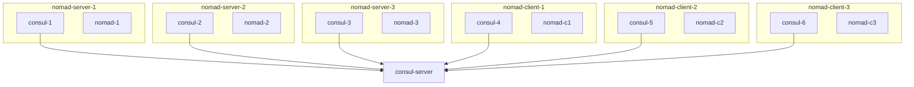

# Scenario 




# Steps

- Let's run the setup with `docker compose up -d`
- Observe Consul UI and Nomad UI
- Run a sample job `nomad run sleep.hcl`  
- Observe Nomad Server logs and Nomad Client logs
- Kill 2 Nomad server containers

# Tasks

- Observe Consul UI, Nomad UI, Nomad Server, Nomad Client logs
- How to recover from the outage?
- What are steps to be done post recovery?

# Helpers

```
# view current containers
docker ps

# view current containers and their IPs
docker ps -q | xargs -n 1 docker inspect --format '{{ .Name }} {{range .NetworkSettings.Networks}} {{.IPAddress}}{{end}}' | sed 's#^/##';

# view running processes in a container
docker exec <container-id> ps aux  

# reload a process config
docker exec <container-id> sh -c 'kill -HUP $(pidof nomad)'
```