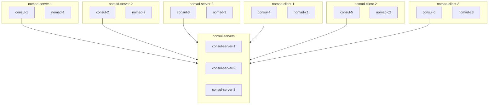

# Scenario 

# Steps

- Let's run the setup with `docker compose up -d`
- Observe Consul UI and Nomad UI
- Run a sample job `nomad run sleep.hcl`  
- Observe Nomad Server logs and Nomad Client logs
- Kill 2 Consul servers

# Tasks

- Observe Consul UI, Nomad UI, Nomad Server, Nomad Client logs
- How to recover from the outage?
- What are steps to be done post recovery?